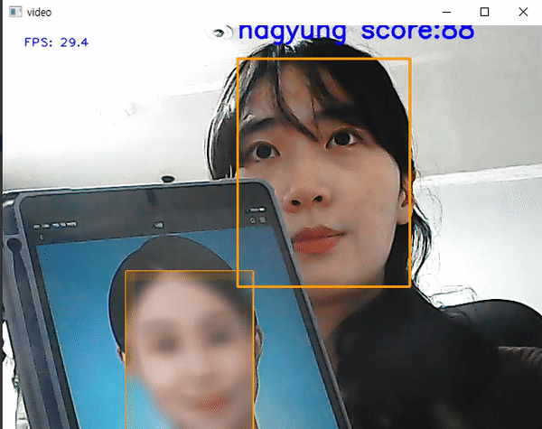

## Realtime_Face_Mosaic

### 1. How to use ?

(1) put your pic into images directory  
(2) run Take_ID.py - (will make your name's directory and put your cropped face pic) 
(3) run facebank.py - (will make facebank.pth, names.npy)  
(4) run facerecognition-realtime.py- (will recognize and automatically mosaic your face)  

### 2. Result

### 3. Reference (highly depended on)

* https://github.com/deepinsight/insightface
* https://github.com/TreB1eN/InsightFace_Pytorch

